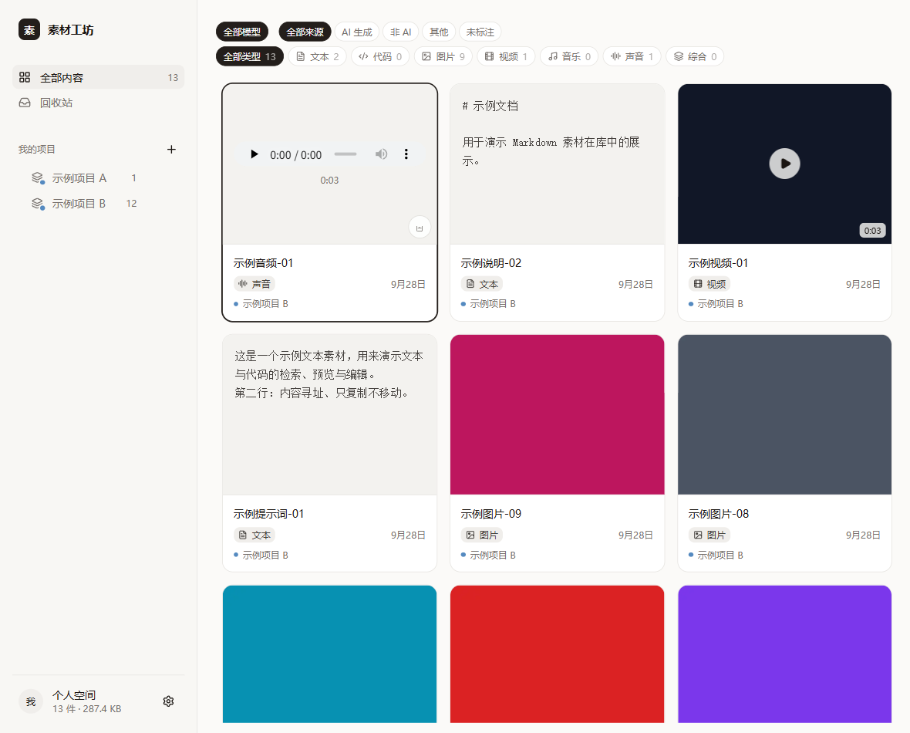

# 素材工坊 · material-forge

[](LICENSE)


本地优先的**素材库**：把散落的图片、视频、音频、文档、代码收进一个**内容寻址**的库里，用浏览器检索、预览、播放、编辑，并把素材挂到项目（分类）上。

**为 AI 而设计**：自带命令行与只读 HTTP 接口，任何能跑命令或发请求的 Agent 都能直接检索、读取、打标签、改元数据、入库 —— 而且每一步都留审计。

数据全部留在本机，不依赖任何云服务；模型能力（画面描述、关键词标签）是可选的增量。



> 上图取自一个**纯合成素材**的演示库（纯色图块 + 生成的视频/音频 + 示例文本），不含任何真实素材。

---

## 亮点

- **内容寻址存储**：对象路径由内容 sha256 推导（`objects/ab/cd/<hash>.png`），天然去重；库改名或搬家后一条 `relink` 就能修好全部引用。
- **元数据不锁死在数据库里**：每个对象旁边写 sidecar JSON，`index.db` 只是索引 —— 删掉它也能从 sidecar 重建。
- **只复制、不移动**：扫描或导入都不动原文件；回收站里的“删除”只动库内副本。
- **可读视图**：用硬链接生成 `可读视图/`（按项目）与 `可读视图-按类型/`，不占额外空间，删了随时重建。
- **给人用的界面**：画廊 / 列表、七类模态、专注模式（图片缩放、视频播放、**真实音频波形**、文本与代码用 CodeMirror 编辑，**版本只留上一版**）。
- **给机器用的接口**：`tools/pm.ts` 命令行（读写都有，全部支持 `--json`）+ `GET /api/openapi.json` 自描述清单（15 条接口，不需要 token）。
- **写操作有审计**：打标签、改元数据、归项目、入库都会写进 `agent_audit` 表（谁、什么时候、改前改后），可用 `pm audit` 查。
- **可选的分析增量**：接一个多模态模型，为每件素材生成一句话描述；再从描述提炼关键词标签。两者都并入全文检索，于是“按意思找”不必上向量库就能用起来。

## 快速开始

```bash
cd 项目管理器
npm install
npm run web:build      # 构建前端
npm run serve          # 默认 http://127.0.0.1:8756
```

数据目录默认是**程序目录下的 `素材库/`**，可用环境变量 `PM_LIBRARY` 指向别处：

```
<库目录>/
  index.db                   索引（可删除、可重建）
  objects/ab/cd/<hash>.ext   托管对象 + <hash>.json sidecar
  derived/thumbs/            缩略图缓存（可再生）
  derived/peaks/             音频波形缓存（可再生）
  可读视图/                   硬链接视图（按项目）
  可读视图-按类型/             硬链接视图（按类型）
  索引.md                     项目 | 标题 | 类型 | 大小 | 对象路径
  trash/  manifests/
```

> ⚠️ 别把库放在 OneDrive / 坚果云 / 网络盘：SQLite 的 WAL 需要共享内存，会损坏数据库。

## 给人和 AI 共用的命令行

在 `项目管理器/` 下 `node --no-warnings tools/pm.ts <命令>`，全部支持 `--json`：

| 命令 | 说明 |
| --- | --- |
| `pm health` | 库是否可用 |
| `pm projects` | 项目树与计数 |
| `pm search --q 关键词 --kind image --project 项目名 --limit 20` | 检索（描述与标签也参与） |
| `pm get <id或sha256:哈希>` | 单件详情（含可读路径与内容地址） |
| `pm read <id或sha256:哈希> [--max-bytes N]` | 文本或代码内容直出 |
| `pm tag <id> --add 词 [--remove 词]` | **写**：增删标签 |
| `pm meta <id> --model 名 --origin ai\|real\|other --params 文本` | **写**：改元数据 |
| `pm project <id> --to 项目名` | **写**：归入项目（`--to ""` 移出） |
| `pm import <路径...> [--to 项目名]` | **写**：把文件入库（按内容哈希幂等，重复内容自动跳过） |
| `pm project --create 名字 [--parent 父名]` | **写**：新建项目 |
| `pm audit [--limit N]` | 最近的写操作记录 |

**引用素材请用 `sha256:哈希`**：改名、移动、换库内 id 都不失效（`id` 只在当前库稳定）。

## 只读 HTTP 接口

```bash
# 自描述清单：15 条接口 + 素材字段说明（不需要 token）
curl http://127.0.0.1:8756/api/openapi.json

# 其余接口需要请求头 x-pm-token（token 在库目录的 runtime.json 里）
curl -H "x-pm-token: $TOKEN" "http://127.0.0.1:8756/api/assets?q=关键词&limit=10"
curl -H "x-pm-token: $TOKEN" "http://127.0.0.1:8756/media/123" -o out.png   # 原始内容，支持 Range
```

命令行方式不需要 token（直接读库）；HTTP 方式需要。写操作目前只走命令行 —— 有意为之：带审计。

## 设计要点

- **元数据不锁死在数据库里**：sidecar 与对象同目录，换工具也不会从头再来。
- **内容寻址**：路径由哈希推导，库整体搬家后一条 `relink` 即可修复引用。
- **原图不存库、派生数据可再生**：`derived/` 与 `index.db` 都是缓存。
- **本地服务有边界**：只绑 `127.0.0.1`、每次启动随机 token、校验 Host（防 DNS rebinding）、不发 CORS 头。
- **写操作留痕**：`agent_audit` 表记录 actor、动作、改前改后；`PM_ACTOR` 可区分调用者。
- **密钥不入代码**：模型接口的地址与密钥走环境变量或外部配置文件，仓库里只有“去哪读”的说明。

## 目录结构

```
项目管理器/           应用本体
  core/              扫描、哈希、元数据、缩略图与波形、索引、查询、导入、维护、组织
  server/            本地 HTTP 服务：REST、媒体流（Range）、缩略图、接口清单
  web/               浏览器前端（React + Vite + 纯 CSS）
  tools/             pm（命令行入口）、relink、tidy、view、promote、caption、tags
  start-server.bat   启动服务并打开浏览器
文档/                需求与调研、设计、验证记录、运维
协作规则.md           本项目的长期规则
经验.md               项目专属经验（路径、接口、命令、边界）
AGENTS.md             给其他 Agent 的使用说明
```

## 已知限制

- `node:sqlite` 内置版本低于 WAL-reset 修复版；当前单写者不触发，**引入多进程写入前必须升级**。
- 库目录别放同步盘或网络盘（WAL 需要共享内存）。
- 模态计数与筛选目前是客户端按已加载的 ≤1000 件算的；素材超过 1000 件时计数会偏小（分页与服务端聚合尚未做）。
- 子项目数据层支持任意深度，界面缩进只到 2 级；“把项目移到别的父项目下”还没有界面。
- 文本编辑的版本历史**只保留上一版**，不能回退到更早。
- 搬家目前只在同盘改名上验证过；备份有校验和清单，但**尚未做真实恢复演练**。
- 仓库里的界面截图取自合成演示库；开发者的真实库截图（含个人素材）不发布。

更完整的“未验证部分”逐条写在各份验证记录里。

## 开发

本项目由 **aaget123** 主导（需求、取舍与验收判断），与 **DSH（DeepSeek Harness）** 结对完成：实现、排查、验证与文档在会话中逐步推进，每一步的实测证据与未验证部分都留在 [`文档/验证记录/`](文档/验证记录/) 里。

- 需求与边界由人决定；DSH 负责落地、复验并在提交信息里说明取舍；
- 破坏性操作（迁移、批量改名、删除）一律先备份、再彩排、可撤销；
- 写操作（打标签、改元数据、归项目、入库）都留审计记录。
## 许可

[MIT](LICENSE)